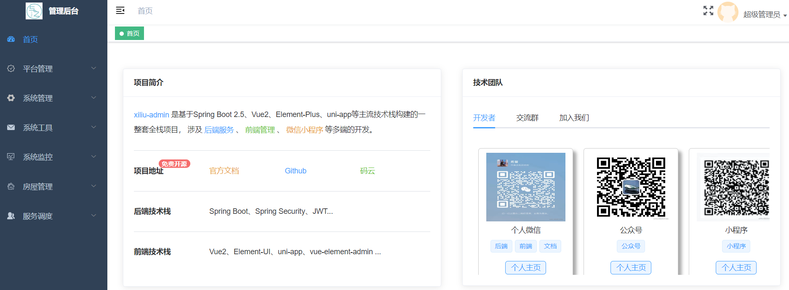

# xiliu-lease-tenant

<p>
  <a href="#公众号"></a>
  <a href="https://github.com/277769738/xiliu-lease-tenant-ui"></a>
  <a href="https://gitee.com/huoqstudy/xiliu-lease-tenant"></a>
</p>


## 前言
xiliu-lease-tenant 是基于[xiliu-tenant](https://gitee.com/huoqstudy/xiliu-tenant)项目搭建而成。 采用B2B2C架构设计，支持多租户saas，在原有的脚手架项目上新增了房屋租赁这一具体的业务。
如果这个项目让你有所收获，记得 Star 关注哦，这对我是非常不错的鼓励与支持。


***温馨提醒***

1. 本项目仅适用于学习交流，并且`不提供无偿的`、 `不提供无偿的`、 `不提供无偿的` 维护修改服务（但可提issue）***
2. 本项目不在任何平台出售，如有发现请积极举报
3. 不要只是白嫖，如果帮到你了麻烦***点个Star***
4. 发现有问题？欢迎加入下方交流群一起探讨，或者直接提Issues

## 项目简介

本项目原本是帮朋友公司做的一个租赁管理系统，用来管理房态信息、办理入住等。对方没给设计图、也没有提具体需求，只是让我凭感觉来做。在项目做了几个月后，因业务调整，所以就没有后续了，想着与其直接删除还不如开源分享给大家一起讨论学习。

> 1、项目虽然没有做的很完整，但是整体的数据架构还算是可以的，可以很容易进行功能完善和添加新功能。

> 2、本系统已经经过测试，可以直接使用,界面可以自己进行修改。本人热爱全栈，热爱vue，热爱java，热爱编程。

> 3、由于本人的精力有限，还有很多地方没法完善，如有感兴趣的朋友，欢迎加入一起完善，共同进步！


## 项目结构树
````
xiliu-lease-tenant
├── xiliu-common --通用模块
|   ├── annotation -- 自定义注解目录
|   ├── component -- 自定义组件目录
|   ├── config -- 通用配置目录
|   ├── constant -- 通用常量目录
|   ├── controller -- 通用controller目录
|   ├── domain -- 通用封装对象
|   ├── enums -- 通用枚举目录
|   ├── page -- 通用分页相关封装目录
|   ├── result -- 通用返回目录
|   ├── utils -- 通用工具类目录
├── xiliu-generator --代码自动生成模块
|   ├── config -- 读取代码生成相关配置
|   ├── constant -- 代码生成常量
|   ├── controller -- 代码生成访问层
|   ├── entity -- 代码生成实体对象
|   ├── mapper -- 代码生成mapper层
|   ├── service --代码生成业务层 
|   ├── utils -- 代码生成器工具类
├── xiliu-server --业务模块
|   ├── common -- 通用目录
|       ├── aspect -- 切面目录
|       ├── component -- token 组件目录
|       ├── domain -- 封装树结构实体类
|       ├── mybatis -- 集成mybatis-plus相关配置目录
|       ├── security -- 集成security相关配置目录
|       ├── utils -- 通用工具类
|   ├── manager -- 异步任务管理器目录
|   ├── modules -- 存放业务代码
|       ├── house -- 房源管理目录
|       ├── monitor -- 系统监控目录
|       ├── platform -- 租户管理目录
|       ├── system -- 系统管理目录    
|   ├── XiliuLeaseServerApplication -- 启动类

````

## 软件需求
* jdk8+
* mysql5.7+
* Maven 3.0+
* Redis 3.0+


## 所用技术
### 前端

技术     | 版本 |  说明 |
-------- | ------ | ------
Vue|	2.6|	前端框架
elementUI|	2.15.X|	ui框架
vuex|	3.1.0|	状态管理库
axios|	0.18.1|	网络请求库
avue|	2.10.10|	elementUI增强库

### 后端

技术     | 版本 |  说明 |
-------- | ------ | ------
SpringBoot|	2.5.4|	容器+MVC框架
SpringSecurity|	5.3.2|	认证和授权框架
MyBatis-Plus|	3.5.1|	MyBatis增强工具
MyBatis-Plus Generator|	3.5.1|	数据层代码生成器
knife4j|	2.0.7|	swagger文档生成工具
Redis|	5.0|	分布式缓存
Docker|	18.09.0|	应用容器引擎
Druid|	1.1.21|	数据库连接池
JWT|	0.9.0|	JWT登录支持
Lombok|	1.18.12|	简化对象封装工具
easyexcel| 2.2.6| 简化导入导出工具

## 数据库表结构


# 开发规约

## 命名规则

- url路径采用 脊柱命名法(server-address)

## 接口定义规则

- 创建表记录：POST /{控制器路由名称}/create
- 修改表记录：POST /{控制器路由名称}/update/{id}
- 删除指定表记录：POST /{控制器路由名称}/delete/{id}
- 分页查询表记录：GET /{控制器路由名称}/list-page
- 获取指定记录详情：GET /{控制器路由名称}/{id}

具体参数及返回结果定义可以运行代码查看Swagger-UI的Api文档：http://localhost:7004/doc.html


# 项目特点

序号     | 模快 |  说明 |
-------- | ------ | ------
1| 租户管理|配置系统租户，支持 SaaS 场景下的多租户功能。
2|配置租户套餐|自定每个租户的菜单、操作、按钮的权限。
3|用户管理|用户是系统操作者，该功能主要完成系统用户配置。
4|部门管理|配置系统组织机构（公司、部门、小组），树结构展现支持数据权限。
5|菜单管理|配置系统菜单，操作权限，按钮权限标识等。
6|角色管理|角色菜单权限分配、设置角色按机构进行数据范围权限划分。
7|字典管理|对系统中经常使用的一些较为固定的数据进行维护。
8|操作日志|系统正常操作日志记录和查询；系统异常信息日志记录和查询。
9|登录日志|系统登录日志记录查询包含登录异常。
10|在线用户|当前系统中活跃用户状态监控。
11|代码生成|前后端代码的生成（java、html、xml、sql）支持CRUD下载 。
12|系统接口|根据业务代码自动生成相关的api接口文档。
13|服务监控|监视当前系统CPU、内存、磁盘、堆栈等相关信息。
13|缓存监控|监视当前缓存的相关信息。
14|房屋管理|添加、导入房源等相关信息。

## 本地部署
进入 xiliu-server 模块，运行 XiliuLeaseServerApplication 类，即可启动


## linux部署


## 项目演示

* 在线体验：[https://lms.xiliu.online](https://lms.xiliu.online)
* 本地体验：http://localhost:9528
* 账号密码：admin/123456

## 系统效果图展示





## 感谢
* 本项目基于若依的前后端分离版，感谢ruoyi-vue


## 交流群
加微信群交流，公众号后台回复「加群」即可。

| 公众号 | QQ群(577105695) | 
| :------: | :------: |
| | | 

## 结语

欢迎一起探讨，如果你觉得还可以，可以给我点一个star
